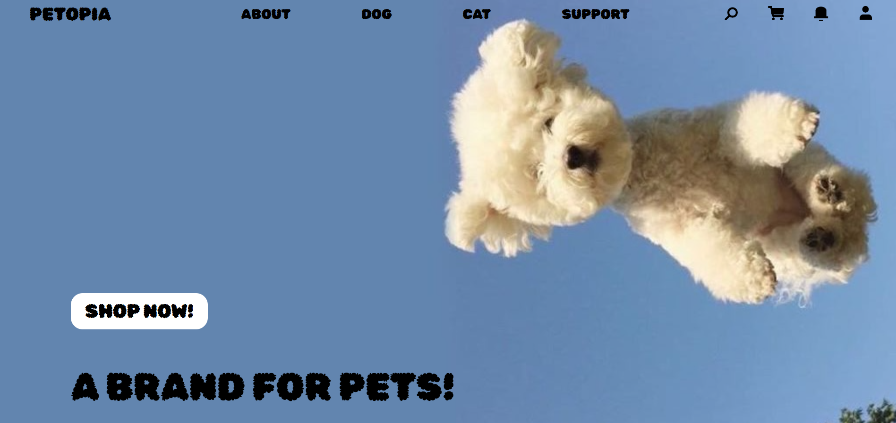

# 🐶Ecommerce - Petopia🐶



## 📖Description

반려동물과 반려인을 위한 이커머스를 구현하였습니다.

조금 더 쉽게 반려용품에 다가갈 수 있습니다.

## 💻Demo & Deployment

<Demo 화면녹화본 추가 예정>

Deployment : <URL 추가 예정>

### 🏁Getting Started

git clone

```
git clone https://github.com/nextrunners5/Full_3_1team
cd Full_3_1team
```

Frontend

```
cd frontend

npm install (의존성 설치)

npm run dev
```

Backend

```
cd backend

npm install (의존성 설치)

npx ts-node server.ts
```

## ✏️Main Feature

### 회원가입 및 로그인, SNS 로그인

* JWT, KAKAO API 이용

### 상품관리

* 관리자 페이지 상품 등록 및 사용자 상품 조회, 장바구니, 주문하기 기능 구현

### 결제 기능

* Toss payments API 이용

### 기타 기능

* 마이페이지
* 배송지 주소 - KAKAO ADDRESS API 이용

## 🛠️Stack


## 👨‍💻 Role & Contribution

##### Frontend (Web)

* 관리자 페이지 (Vue.js) 개발
* 전체 아키텍처 구성

##### Devops

* ~~CI/CD 구축 (Docker, Github Action)~~
* ~~서버 모니터링~~

##### etc

전체 개발 일정 및 이슈 관리

## 🧑‍🧑‍🧒‍🧒Developers(github account)

* 민은빈 silverbin1004
* 김수현 suhyeon1103
* 박영빈 YoungBeenPark
* 윤지은 y00njieun
* 하태웅 hamasu271
